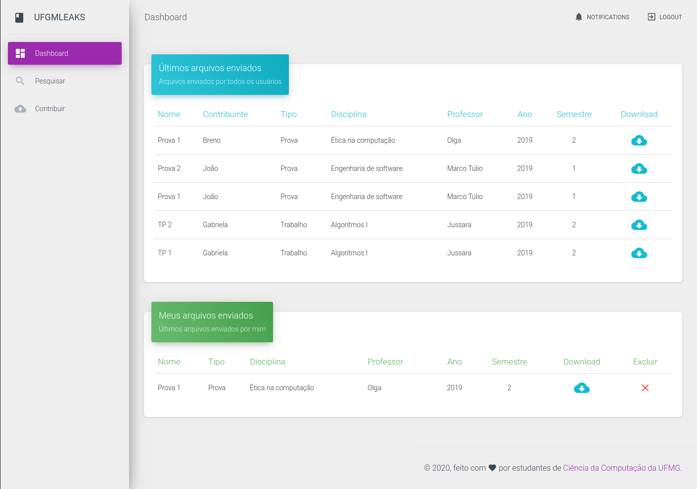

# UfmgLeaks

Flask web application to help students of UFMG to share school related materials.




## Test coverage

<pre>
Name            Stmts   Miss  Cover
-----------------------------------
app.py            171     39    77%
db.py              24     10    58%
models.py           3      0   100%
test_breno.py     140      0   100%
-----------------------------------
TOTAL             338     49    86%
</pre>

## How to run

Flask is simple! Just clone this repository, enter it and then run:

```console
   bash runflask
```

## Worked hours

https://docs.google.com/spreadsheets/d/1m_xMYajkkzRHYYktt6b5GvDiEAU5XsoS23BfwdDMKgs/edit#gid=0

## Burdown chart

https://docs.google.com/spreadsheets/d/1m_xMYajkkzRHYYktt6b5GvDiEAU5XsoS23BfwdDMKgs/edit#gid=1076055173

## Commits

https://docs.google.com/spreadsheets/d/1m_xMYajkkzRHYYktt6b5GvDiEAU5XsoS23BfwdDMKgs/edit#gid=820609043
